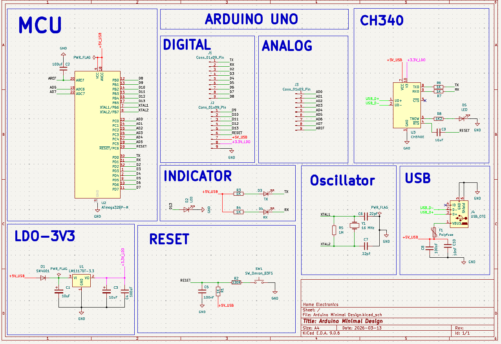
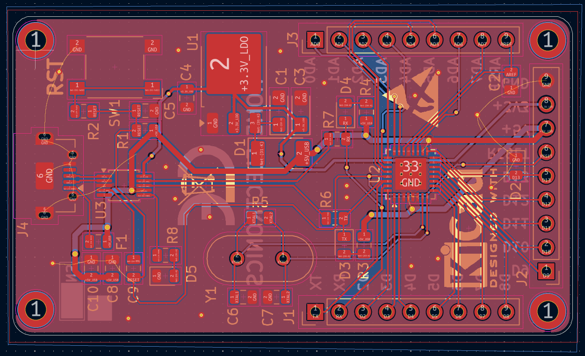

# Arduino Minimal Design

A **minimal Arduino-compatible board** built around the **ATmega328P-M** microcontroller with an integrated **CH340E USB-to-Serial interface** for direct programming via USB.

The goal of this project is to demonstrate a **compact and practical Arduino hardware implementation** using minimal components while maintaining full functionality.

---

## Features

* ATmega328P based Arduino-compatible design
* Integrated **CH340E USB-to-UART** converter
* **Micro USB programming interface**
* 16 MHz crystal oscillator
* On-board **TX/RX status LEDs**
* Compact PCB layout with minimal components

---

## Hardware Architecture

The board consists of four main functional blocks:

**1. Microcontroller**

* ATmega328P-M
* External 16 MHz crystal
* Reset circuit

**2. USB Interface**

* CH340E USB to UART converter
* Micro USB connector

**3. Power Regulation**

* LM1117-3.3 linear regulator
* Input protection and filtering

**4. Status Indicators**

* Power LED
* TX/RX communication LEDs

---

## Schematic & PCB Layout

  

  

    
---

## 3D View

  

  

---

## Bill of Materials (BOM)

| Component           | Description                        | Qty |
| ------------------- | ---------------------------------- | --- |
| ATmega328P-M        | Microcontroller                    | 1   |
| CH340E              | USB to UART Converter              | 1   |
| LM1117DT-3.3        | Voltage Regulator                  | 1   |
| 16 MHz Crystal      | Clock Source                       | 1   |
| USB Micro Connector | Programming Interface              | 1   |
| Polyfuse            | USB Protection                     | 1   |
| SM4001              | Protection Diode                   | 1   |
| Reset Switch        | Push Button Reset                  | 1   |
| LEDs                | Power / TX / RX Indicators         | 4   |
| Resistors           | Various (330Ω, 1kΩ, 1k2Ω, 1MΩ)     | 9   |
| Capacitors          | Various (22pF, 100nF, 10uF, 100uF) | 10  |
| Pin Headers         | I/O Connections                    | 3   |

---

## Programming

The board can be programmed directly through the **USB interface**.

Steps:

1. Connect the board via **Micro USB**
2. Install **CH340 driver** (if not already installed)
3. Open **Arduino IDE**
4. Select **Arduino Uno / ATmega328P**
5. Choose the correct **COM port**
6. Upload your sketch

---

## Applications

This board can be used for:

* Embedded system prototyping
* IoT projects
* Arduino-based hardware development
* Learning **custom PCB design for microcontrollers**

---

## Tools Used

* **KiCad** – Schematic and PCB design
* **Arduino IDE** – Firmware programming

---

## Author

**Sushant Saroch**
Electronics & Communication Engineer
Focus: Embedded Systems • PCB Design • Hardware Development

---

⭐ If you find this project useful, consider starring the repository.
